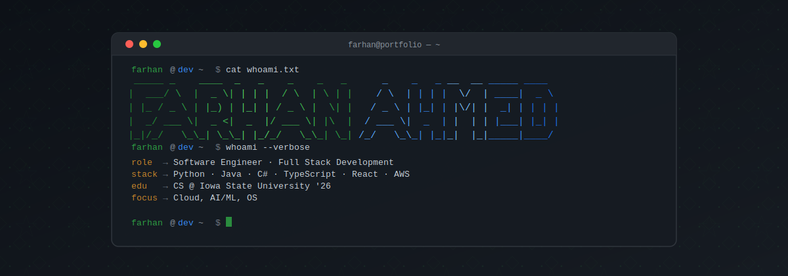

 

---

<h2><code>whoami</code></h2>

- Computer Science @ Iowa State University
- Building [`hancover-action`](https://github.com/farhan-ahmed1/hancover-action) — a code coverage tool
- Building [`sidrat`](https://www.sidratapp.com/) with [`Liban-Ahmed`](https://github.com/Liban-Ahmed)

---

<h2><code>skills</code></h2>

<table>
  <tr>
    <td><strong>Languages</strong></td>
    <td>
      
      
      
      
      
    </td>
  </tr>
  <tr>
    <td><strong>Frameworks</strong></td>
    <td>
      
      
      
    </td>
  </tr>
  <tr>
    <td><strong>Databases</strong></td>
    <td>
      
      
      
    </td>
  </tr>
</table>

---

<h2><code>github stats</code></h2>

